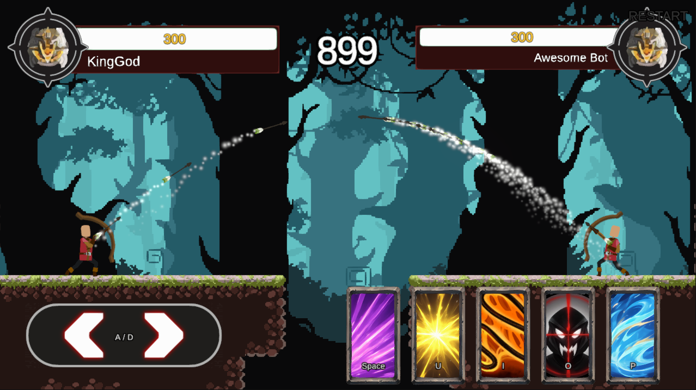

# Archer of GOD

- 게임 `Archer of God` 모작입니다.
- 작업과정 동영상 녹화완료 및 보관중. 필요시 요청. (mrsions@gmail.com)
- [여기를 눌러 데모](https://archer-of-god.pages.dev)를 할 수 있습니다.

# 조작방법

- 키보드
    - **이동(2개)** : ad
    - **스킬(5개)** : space, u, i, o, p
- 터치 스크린
- Xbox 컨트롤러 :
    - **이동(2개)** : leftStick
    - **스킬(5개)** : X, Y, A, B, RightButton

# 개발스텍

- Unity 6.2.14f1 
- VisualStudio 2022
- UniTask.
- Ugui, Ui-Extension
- InputSystem, Timeline
- Urp-2D, Sprite, Sprite-Atlas, 2D-Skinning, Volume(Bloom)
- Physics2D Rigidbody2D, Collider2D

# 작업내용

- `Archer of God` 게임 시스템 일부 모작. (평균 8시간씩 4일간 작업)
- 게임 시스템 설계 및 개발 구현.
- 리소스 리서치, 추가, 편집 작업.
- UI 디자인 모작, 배치, 컴포넌트 구현.
- 캐릭터 움직임, 사격, 스킬사용 개발.
- 캐릭터 스킬 개발.
- 통합 컨트롤러 개발. (플레이어, AI 인터페이스)
- 객체 심플 풀링 시스템 개발.

# Used Asset Or Package

Github에 재배포하지 못하는 어셋들입니다. 직접 설치하셔야 프로젝트 구동이 가능합니다.

## 포함됨

- [(포함됨) UI-Extension](https://github.com/Unity-UI-Extensions/com.unity.uiextensions)
- [(포함됨) UniTask](https://github.com/Cysharp/UniTask)

## 설치필요 (재배포불가)

- [(설치필요) 25 FREE hunter skill icons](https://assetstore.unity.com/packages/p/25-free-hunter-skill-icons-248516)
- [(설치필요) 500 Free Skill Icons](https://assetstore.unity.com/packages/p/500-free-skill-icons-344112)
- [(설치필요) AOE Explosions Pack 2](https://assetstore.unity.com/packages/p/aoe-explosions-pack-2-247466)
- [(설치필요) Area of Effect Spell FREE](https://assetstore.unity.com/packages/p/area-of-effect-spell-free-287652)
- [(설치필요) Card shirts Lite](https://assetstore.unity.com/packages/p/card-shirts-lite-165698)
- [(설치필요) Cartoon FX Free Pack](https://assetstore.unity.com/packages/p/cartoon-fx-free-pack-169179)
- [(설치필요) DOTween (HOTween v2)](https://assetstore.unity.com/packages/tools/animation/dotween-hotween-v2-27676)
- [(설치필요) FREE - RPG Fantasy Spell Icons](https://assetstore.unity.com/packages/p/free-rpg-fantasy-spell-icons-200511)
- [(설치필요) Miniature Army 2D V.1 [Medieval Style]](https://assetstore.unity.com/packages/p/miniature-army-2d-v-1-medieval-style-72935)
- [(설치필요) Pixel Art Woods Tileset and Background](https://assetstore.unity.com/packages/2d/environments/pixel-art-woods-tileset-and-background-280066)
- [(설치필요) Status and Auras FREE](https://assetstore.unity.com/packages/vfx/particles/spells/status-and-auras-free-289450)
- [Free 10 Medieval Ambient Fantasy Tracks Music Pack](https://assetstore.unity.com/packages/p/free-10-medieval-ambient-fantasy-tracks-music-pack-310781)
- [FREE Casual Game SFX Pack](https://assetstore.unity.com/packages/p/free-casual-game-sfx-pack-54116)
- [Hints Stars Points & Rewards Sound Effects - Lite Pack](https://assetstore.unity.com/packages/p/hints-stars-points-rewards-sound-effects-lite-pack-295538)
- [RPG Essentials Sound Effects - FREE!](https://assetstore.unity.com/packages/p/rpg-essentials-sound-effects-free-227708)
- [Shooting Soun](https://assetstore.unity.com/packages/p/shooting-sound-177096)

# License

- [CC BY-NC-SA 4.0 문서 참고](LICENSE)
